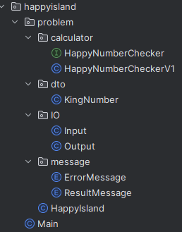
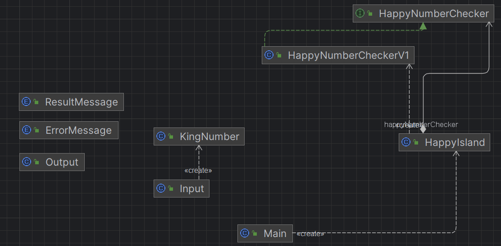

# 1. 해피 아일랜드의 수학자
### 문제 분석

1. 등장하는 것
- 수학자 : 계산결과를 output해주는 역할
- 국왕 : 입력 값을 넣는 역할
- 해피 아일랜드의 행복한 수 판별법 : 입력 받은 값을 true or false 형태로 판별하는 로직
2. 행복한 수
- 행복한 수
    - 각 자릿수의 제곱의 합을 계속하여 연산했을 때, 결과적으로 1에 도달하는 수
- 행복한 수가 아닌 수
    - 행복한 수인지 판별하는 과정에서, 같은 수가 반복되는 사이클이 발생하는 수

### 제약 조건

- 입력으로 주어지는 n의 범위는 1 이상 1,000,000 이하입니다.
- 행복한 수를 판별하는 과정에서 성능 최적화를 고려해야 하며, 프로그램의 실행 시간은 1초를 넘지 않아야 합니다.


### 요구사항 분석

- n을 입력받습니다.
- 결과는 "1" 또는 "0"으로 출력되어야 합니다. "1"은 행복한 수를, "0"은 행복한 수가 아닌 경우를 의미합니다.

# 코드
## 패키지 구조

## 코드 살펴보기 [main]
### HappyIsland
```java
public class HappyIsland {

    private static final int MINIMUM = 1;
    private static final int MAXIMUM = 1000000;

    private final HappyNumberChecker happyNumberChecker;

    public HappyIsland() {
        this.happyNumberChecker = new HappyNumberCheckerV1();
    }

    public void run() {
        KingNumber kingNumber = Input.InputKingNumber();

        checkOutOfRangeNumber(kingNumber);

        Output.displayResult(happyNumberChecker.isHappy(kingNumber.getNumber()));
    }

    private void checkOutOfRangeNumber(KingNumber kingNumber) {
        if (isOutOfRangeNumber(kingNumber.getNumber())) { // 요구하는 숫자가 범위를 넘어가면 해당 프로그램 종료
            throw new IllegalArgumentException(ErrorMessage.OUT_OF_RANGE.getMessage());
        }
    }

    private boolean isOutOfRangeNumber(int n) { // 제한수 체크
        return MINIMUM > n || n > MAXIMUM;
    }
}
```
* 역할
  * 전체 로직을 담당한다.
* 고민
  * checkOutOfRangeNumber의 책임이 애매하다. 
    * 추후 validation에 대한 패키지 혹은 클래스를 생성하여 책임 분리를 할 필요가 있다.
    * 동시에, 가벼운 프로그램에서 그렇게까지 책임을 세분화하는 것을 결국 과도한 분리로, 개발 효율을 악화시킬 경향이 있다.
  * 예외를 터뜨리는 것이 맞는가
    * 비즈니스 로직상 에러가 발생하면 이를 controllerAdvice가 핸들링을 하여 exception에 따른 미리 설계된 api를 준다.
    * 하지만 위의 말은 서버 개발할 때의 의미고, 지금은 단순한 프로그램이다
    * exception에 대한 핸들링도 되어있지 않다.
    * [수정]
      * 요구사항에는 없지만 요구사항에서 출력 형식은 간단한 문자 및 문구로 예측되므로 main에서 try catch를 통해 예외를 잡아 출력을 해주었다.
      * try catch를 main에서 해야하는 건지, 실제 run을 진행하는 HappyIsland에서 해야하는건지 책임에 대한 구분에 대한 확신이 잘 서지 않는다.
### ResultMessage
```java
public enum ResultMessage {
    UNHAPPY_NUMBER("0"),
    HAPPY_NUMBER("1");

    private final String message;

    ResultMessage(String message) {
        this.message = message;
    }

    public String getMessage() {
        return message;
    }
}
```
### ErrorMessage
```java
public enum ErrorMessage {
    OUT_OF_RANGE("국왕께서 문의 주신 숫자로 행복한 수를 판별할 수 없습니다.\n 숫자의 범위는 1이상 1,000,000 이하입니다.");

    private final String message;

    ErrorMessage(String message) {
        this.message = message;
    }

    public String getMessage() {
        return message;
    }
}
```
* 두 클래스 모두 Message들을 담은 데이터 저장 역할을 하고 있다.
* 추후 추가 기능 요구사항이 들어오면 Message들을 따로 분리하여 정리할 필요가 있으므로 `private static final`을 통해 상수화를 하지 않았다.

### Input
```java
public class Input {

    //국왕이 입력한 숫자를 DTO로 반환
    public static KingNumber InputKingNumber() {
        Scanner scanner = new Scanner(System.in);
        return new KingNumber(scanner.nextInt());
    }
}
```
* 입력의 역할을 담당한다.
* DTO를 쓴 이유
  * 역할 분리
    * DTO를 통해 데이터 이동에 대한 책임을 분리하였다.
  * 기능 요구사항 수정
    * 추후 국왕이 전달할 데이터가 숫자 하나가 아닌, 여러 숫자일 경우에 코드 변경이 꽤나 번거로워진다.
    * DTO로 데이터 형식을 통일하여 외부 입력 요구사항 변화에 쉽게 대응할 수 있도록 하였다.
  * 가독성
    * 입력한 값이 어떠한 목적을 가졌고, 어떤 의미를 가졌는지 알아야한다. 단순히 int n 으로 나타내면 추후 협업 시에 쓸데없는 소통이 생기고, 오히려 개발이 늦춰질 수 있다.
### Output
```java
import org.happyisland.problem.message.ResultMessage;

public class Output {

    public static void displayResult(boolean isHappy) {
        if (isHappy) {
            System.out.println(ResultMessage.HAPPY_NUMBER.getMessage());
        } else {
            System.out.println(ResultMessage.UNHAPPY_NUMBER.getMessage());
        }
    }
}
```
* 출력을 담당한다.
* DTO를 쓰지 않은 이유
  * 우선 기존 요구사항은 "0","1"과 같은 단수 메세지를 출력하라고 하였다.
  * 메세지 내용 자체가 변경되더라도 ENUM 클래스 내에서 충분히 수정 가능하다.
  * 위의 이유를 바탕으로 ENUM이 DTO의 역할을 어느정도 수행하고 있다고 판단하였다.
  * 기능 요구사항이 수정되면, 그때 DTO를 넣어도 늦지 않다고 판단했다.
### HappyNumberChecker
```java
public interface HappyNumberChecker {

    boolean isHappy(int n);
}
```
* 굳이 인터페이스 형식으로 한 이유
    * 리팩토링
      * 이 기능은 해당 프로그램의 핵심 로직이다.
      * 이 기능이 지속적인 협업을 통해 실행 시간을 더 단축시킬 수 있을지도 모른다.
      * 그러한 업데이트가 되면서 추후 업데이트된 로직에 큰 논리적 이슈가 생기면 이전 로직을 실행해야하는 등 다양한 상황이 발생할 수 있다.
      * 그에 따라 신속하게 대응하기 위함이다.
    * 다양한 방법
      * 배포시 행복 아일랜드 뿐만아니라 조금행복 아일랜드라는 또 다른 나라가 있을지도 모른다.
      * 혹은 지역에 따라 계산법이 다를지도 모른다.
      * 다양한 유저를 확보할 때, 기능 확장을 염두해 둔 구조다.
### HappyNumberCheckerV1
```java
public class HappyNumberCheckerV1 implements HappyNumberChecker {

    public boolean isHappy(int n) {
        Set<Integer> seen = new HashSet<>();  // 숫자가 반복되는지 확인하기 위한 집합
        while (n != 1 && !seen.contains(n)) {
            seen.add(n);
            n = getNextNumber(n);
//            System.out.println(n);
        }
        return n == 1;  // 1이 되면 true를 반환하고, 사이클이 발생하면 false를 반환
    }

    private static int getNextNumber(int n) {
        int totalSum = 0;
        while (n > 0) {
            int digit = n % 10;  // 마지막 자릿수 추출
            totalSum += digit * digit;  // 자릿수의 제곱을 합산
            n /= 10;  // 다음 자릿수로
        }
        return totalSum;
    }
}
```
* 핵심 로직
  * HashSet을 사용한 이유
    * 중복 감지
      * Set자체의 중복 불허 특징을 사용
    * 빠른 탐색
      * 해시 함수를 통해 요소를 탐색하므로 상수시간에 근접한다.

### main
```java
public class Main {

    public static void main(String[] args) {
        HappyIsland happyIsland = new HappyIsland();
        try {
            happyIsland.run();
        } catch (IllegalArgumentException e) {
            Output.displayError();
        }
    }
}
```
## 코드 살펴보기 [test]
### HappyNumberCheckerV1Test
```java
class HappyNumberCheckerV1Test {

    private final HappyNumberCheckerV1 happyNumberCheckerV1 = new HappyNumberCheckerV1();

    @Test
    void 결과_1의_경우() {
        int[] happyNumbers = {19, 7, 1, 10, 100, 130, 97, 123456};
        for (int num : happyNumbers) {
            assertThat(happyNumberCheckerV1.isHappy(num)).isTrue();
        }
    }

    @Test
    void 반복되는_사이클의_경우() {
        int[] unhappyNumbersWithCycle = {4, 20, 2, 3, 11, 22, 58};
        for (int num : unhappyNumbersWithCycle) {
            System.out.println("cycle : " + num);
            assertThat(happyNumberCheckerV1.isHappy(num)).isFalse();
        }
    }

    @Test
    void 결과_0의_경우() {
        int[] unhappyNumbersWithoutCycle = {999999, 888888};
        for (int num : unhappyNumbersWithoutCycle) {
            System.out.println(num);
            assertThat(happyNumberCheckerV1.isHappy(num)).isFalse();
        }
    }


    @Test
    void 시간_검사() {
        int[] happyNumbers = {999999, 888888, 777777, 1000000};
        for (int num : happyNumbers) {
            long startTime = System.nanoTime(); // 시작 시간 측정
            happyNumberCheckerV1.isHappy(num);
            long endTime = System.nanoTime(); // 종료 시간 측정
            long duration = (endTime - startTime) / 1_000_000; // 밀리초로 변환
            assertThat(duration).isLessThan(1000); // 실행 시간이 1초 미만인지 확인
            System.out.println(duration);
        }
    }
}
```
* 다양한 결과의 경우
  * 결과 1이 나올 경우
  * 반복되는 사이클
  * 결과 0의 경우
* 시간 검사
  * 최악의 조건에 대해서 1초 미만인지 검사
### OutputTest
```java
class OutputTest {

    @BeforeEach
    public void setUp() {
        TestUtils.setUpOutputCapture();
    }

    @AfterEach
    public void tearDown() {
        TestUtils.restoreOriginalOutput();
    }

    @Test
    public void 행복한_수_정상출력() {
        Output.displayResult(true);
        assertThat(TestUtils.getOutput()).isEqualTo(ResultMessage.HAPPY_NUMBER.getMessage());
        TestUtils.resetOutputCapture();
    }

    @Test
    public void 행복한_수가_아닌_수_정상출력() {
        Output.displayResult(false);
        assertThat(TestUtils.getOutput()).isEqualTo(ResultMessage.UNHAPPY_NUMBER.getMessage());
        TestUtils.resetOutputCapture();
    }
}
```
* 행복한 수 정상출력
* 행복한 수가 아닌 수에 대해서 정상 출력
## 클래스 의존관계
