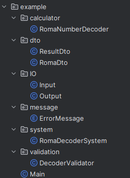
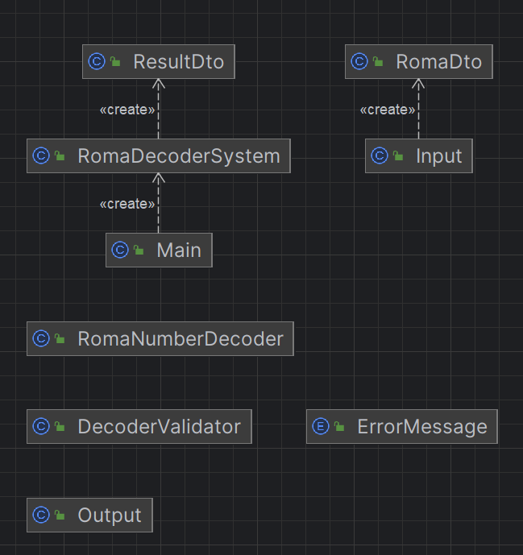

# 2. 해피 아일랜드의 수학자
https://github.com/jiseop121/bootAgit-test/tree/main/roma
## 문제 분석

### 문제 이해
로마 숫자로 암호화된 메시지를 해독하여 정수 값으로 변환하는 프로그램을 작성해야 합니다. 로마 숫자는 특정 규칙에 따라 큰 기호가 작은 기호의 왼쪽에 있으면 더하고, 작은 기호가 큰 기호의 왼쪽에 있으면 뺍니다. 예를 들어, "IV"는 4, "IX"는 9로 변환됩니다.

### 제약 조건
1. **입력 문자열 길이**: 로마 숫자 문자열의 길이는 1 이상 15 이하입니다.
2. **정형화된 로마 숫자 표기법**: 올바른 로마 숫자 표기법만 허용됩니다. 예를 들어, "IIX"나 "VX"와 같은 표기는 잘못된 것으로 간주됩니다.
3. **잘못된 표기 처리**: 잘못된 로마 숫자 표기가 입력으로 주어지면 "잘못된 로마 숫자 표기입니다."라는 메시지를 출력해야 합니다.
4. **최대 값**: 로마 숫자로 표현할 수 있는 최대 값은 3999입니다. 이를 초과하는 값이 입력으로 주어지면 "표현할 수 없는 범위의 수입니다."라는 메시지를 출력해야 합니다.

## 해결 핵심 로직
1. **로마 숫자와 정수 값의 매핑**: 각 로마 숫자 기호에 해당하는 정수 값을 매핑합니다.
2. **입력 문자열의 유효성 검사**: 정규 표현식을 사용하여 입력된 로마 숫자 문자열의 유효성을 검사합니다.
3. **로마 숫자를 정수로 변환**: 문자열을 순회하며 현재 문자와 다음 문자를 비교하여 값을 계산합니다.
4. **최대 값 검사**: 변환된 값이 3999를 초과하는지 검사합니다.

## 코드분석[main]
* 패키지 구조는 1번문제와 유사하다
* 다만 메인 run 동작을 할 수 있는 시스템 클래스를 system 패키지 안에 넣어서 병렬적으로 처리했다.


### RomaNumberDecoder
```java
package org.example.calculator;

import java.util.HashMap;
import java.util.Map;
import org.example.dto.RomaDto;
import org.example.validation.DecoderValidator;

public class RomaNumberDecoder {

    private static final Map<Character, Integer> romanToIntegerMap = new HashMap<>();

    static {
        romanToIntegerMap.put('I', 1);
        romanToIntegerMap.put('V', 5);
        romanToIntegerMap.put('X', 10);
        romanToIntegerMap.put('L', 50);
        romanToIntegerMap.put('C', 100);
        romanToIntegerMap.put('D', 500);
        romanToIntegerMap.put('M', 1000);
    }

    public static int romanToInt(RomaDto romaDto) {
        String romanNumeral = romaDto.getRomanNumeral();

        DecoderValidator.isValidRomanNumeral(romanNumeral);

        int total = 0;
        int prevValue = 0;

        for (int i = romanNumeral.length() - 1; i >= 0; i--) {
            int currentValue = romanToIntegerMap.get(romanNumeral.charAt(i));
            if (currentValue < prevValue) {
                total -= currentValue;
            } else {
                total += currentValue;
            }
            prevValue = currentValue;
        }

        DecoderValidator.isOverMaxValue(total);

        return total;
    }
}

```
* 핵심 로직이다.
* HashMap을 사용한 이유
  * 로마문자와, 아라비아 숫자가 1대1 대응되므로 Map의 자료구조가 적합해보였다.
  * Hash 함수를 통해 각 로마문자를 찾는 시간을 최대한 줄였다.

### ResultDto
```java
public class ResultDto {
    private final String romanNumeral;
    private final int number;

    public ResultDto(String romanNumeral, int number) {
        this.romanNumeral = romanNumeral;
        this.number = number;
    }

    public String getRomanNumeral() {
        return romanNumeral;
    }

    public int getNumber() {
        return number;
    }
}

```
* Output에 데이터 이동을 위한 DTO다.
* 로마문자와 결과값을 함께 담기 위해 DTO를 사용하였다.
* 그 외의 이유는 1번 문제와 동일하다

### RomaDto
```java
package org.example.dto;

public class RomaDto {
    private final String romanNumeral;

    public RomaDto(String romanNumeral) {
        this.romanNumeral = romanNumeral;
    }

    public String getRomanNumeral() {
        return romanNumeral;
    }
}

```
* Input에서 데이터 이동을 위한 DTO다.
### Input
```java
public class Input {

    public static RomaDto InputRoma() {
        Scanner scanner = new Scanner(System.in);
        return new RomaDto(scanner.next());
    }
}

```
### Output
```java
public class Output {

    public static void displayResult(ResultDto resultDto) {
        System.out.println("로마 숫자 " + resultDto.getRomanNumeral() + "의 정수 값은 " +
            resultDto.getNumber() + "입니다.");
    }
    public static void displayError(IllegalArgumentException e){
        System.out.println(e.getMessage());
    }
}

```
* 각각 인풋과 아웃풋에 대한 역할을 수행하는 클래스다.

### ErrorMessage
```java
public enum ErrorMessage {
    INVALID_ROMAN_NUMERAL("잘못된 로마 숫자 표기입니다."),
    OUT_OF_RANGE("표현할 수 없는 범위의 수입니다.");

    private final String message;

    ErrorMessage(String message) {
        this.message = message;
    }

    public String getMessage() {
        return message;
    }
}
```
* ErrorMessage만 enum으로 생성한 이유
  * Output에 대해서는 유동성이 많고, 결과가 여러개를 따로따로 나타내지 않기 때문에
  * 이 경우에는 오히려 enum으로 굳이 역할 분리를 할 필요성을 느끼지 못했다.
  * 하지만 에러메세지는 최소 2개 이상이 쓰이며, 추후 리팩토링 시 다양한 에러가 나올 수 있으므로 enum으로 역할을 분리하였다.

### DecoderValidator
```java
public class DecoderValidator {
    public static void isValidRomanNumeral(String s) {
        // 패턴 기반의 로마 숫자 검증
        String pattern = "^M{0,4}(CM|CD|D?C{0,3})(XC|XL|L?X{0,3})(IX|IV|V?I{0,3})$";
        if(!s.matches(pattern)){
            throw new IllegalArgumentException(ErrorMessage.INVALID_ROMAN_NUMERAL.getMessage());
        }
    }

    public static void isOverMaxValue(int resultValue){
        if(resultValue > 3999){
            throw new IllegalArgumentException(ErrorMessage.OUT_OF_RANGE.getMessage());
        }
    }
}

```
* 이번엔 Validator를 사용한 이유
  * 1번에서의 아쉬움도 있었고
  * 이번에는 아예 validator에 exception throw의 책임을 주기로 하였다.
  * 그래서 확실한 역할 분리를 수행하였다.
### RomaDecoderSystem
```java
package org.example.system;


import org.example.IO.Input;
import org.example.IO.Output;
import org.example.calculator.RomaNumberDecoder;
import org.example.dto.ResultDto;
import org.example.dto.RomaDto;

public class RomaDecoderSystem {

    public RomaDecoderSystem() {
    }

    public void run() {
        try {
            RomaDto romaDto = Input.InputRoma();
            int romanToInt = RomaNumberDecoder.romanToInt(romaDto);
            Output.displayResult(new ResultDto(romaDto.getRomanNumeral(), romanToInt));
        } catch (IllegalArgumentException e) {
            Output.displayError(e);
        }
    }
}

```
* 1번때와 달리 try catch를 이 시스템에서 잡아주도록 책임을 바꾸었다.
* 또한 모든 로직이 DTO를 통해서 수행되도록 노력하였다.
## 코드 분석[test]
### RomaNumberDecoderTest
```java
package org.example.calculator;

import static org.assertj.core.api.Assertions.assertThat;
import static org.assertj.core.api.Assertions.assertThatThrownBy;

import org.example.dto.RomaDto;
import org.example.message.ErrorMessage;
import org.junit.jupiter.api.Test;

class RomaNumberDecoderTest {

    @Test
    public void 정상_로마숫자() {
        RomaDto romaDto = new RomaDto("MCMXCIV");
        int result = RomaNumberDecoder.romanToInt(romaDto);
        assertThat(result).isEqualTo(1994);
    }

    @Test
    public void 로마숫자_범위초과() {
        RomaDto romaDto = new RomaDto("MMMM");
        assertThatThrownBy(() -> RomaNumberDecoder.romanToInt(romaDto))
            .isInstanceOf(IllegalArgumentException.class)
            .hasMessage(ErrorMessage.OUT_OF_RANGE.getMessage());
    }

    @Test
    public void 로마숫자_형식에러() {
        RomaDto romaDto = new RomaDto("II1");
        assertThatThrownBy(() -> RomaNumberDecoder.romanToInt(romaDto))
            .isInstanceOf(IllegalArgumentException.class)
            .hasMessage(ErrorMessage.INVALID_ROMAN_NUMERAL.getMessage());
    }
}
```
* 핵심로직만 테스트를 수행하였다.
* 두 가지의 예외 사항과 정상 사항을 고려하여 작성하였다.

### 클래스 의존 관계
